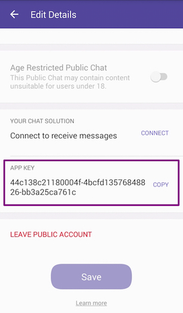

# Authentication

To use the Viber Bots API, you need to provide a unique and secret authentication token,<br/> 
also known as the application key. This token acts as a identifier for your Viber account<br/>
and is used to authenticate requests sent to the Viber API. It is important to keep this<br/>
token secure to prevent unauthorized access to your Viber account.

## Obtaining an Authentication Token
Upon creation of your Viber bot, an authentication token will be generated. This token can<br/>
be viewed by the account’s administrators in the “edit info” screen of their bot or on the<br/>
[Viber Admin Panel](https://partners.viber.com/login).



## Using the Authentication Token
The authentication token must be included in the header of every API request you make.<br/>
The header should include the following field:

```makefile title="Http Header"
X-Viber-Auth-Token: <YOUR_AUTHENTICATION_TOKEN>
```

Replace **'<YOUR_AUTHENTICATION_TOKEN>'** with your actual authentication token.

:::caution Important

Failing to send the authentication token in the header will result in an error with the `missing_auth_token` message.

:::

## Security Considerations
It is important to keep your authentication token secret and secure. Never share your<br/>
authentication token with anyone and do not include it in any public code or<br/>
documentation.