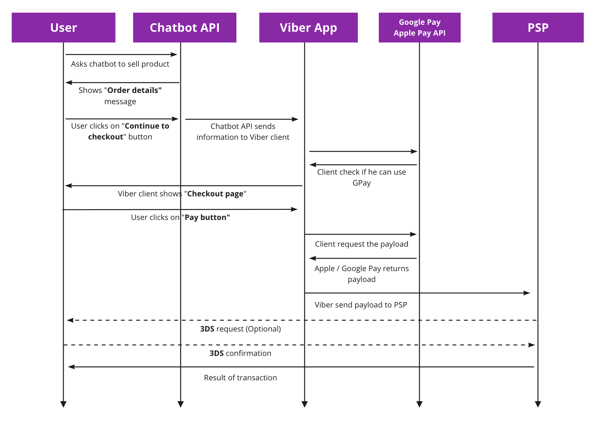

**`POST` https://<area/>chatapi.viber.com/pa/send_message**

To request a payment from one of your bot subscribers you need to use the send message<br/>
endpoint and specify the `payment` message type.<br/>
When sending the payment request the user will be presented with a payment button,<br/>
_continue to checkout_ that will expire after 15 minutes.<br/>
See the figure below to understand the flow of the payment request.



### Payment Request
#### Headers
---
**Content-Type:** application/json<br/>
**Authorization:** X-Viber-Auth-Token: YOUR_AUTHENTICATION_TOKEN

#### Parameters
---
| Name | Type | Description | Notes |
| --- | --- | --- | --- |
| receiver | string | The id of the subscriber. | |
| sender.name | string | The name of the bot. | **Required.** Max 28 characters. |
| sender.avatar | string | The avatar of the bot. | **Optional.** the avatar size should not exceed 100KB. The recommended dimensions for the avatar are 720x720. |
| min_api_version | integer | The minimum API version of the subscriber. | **Required.** Payment request are supported from v10 and above|
|type|string|The type of the message.|**Required.** Must be `payment`|
|payment|object|The payment object.|**Required.**|
|payment.type|string|The type of the payment.|**Required.** . Currently only “GooglePay” for Android devices and “ApplePay” for iOS devices are valid. |
|payment.description|string|The description of the payment.|**Optional.**|
|payment.total_price|float|The total price of the payment.|**Required.** For example 30.56|
payment.currency_code|string|The currency code of the payment.|**Required.** Currency string according to [ISO 4217](https://en.wikipedia.org/wiki/ISO_4217#:~:text=US%22%20(United%20States).-,List%20of%20ISO%204217%20currency%20codes,-%5Bedit%5D) format (e.g American dollar would be `USD`).|
|payment.payment_parameters|object|The payment parameters object.|**Required.** The payment paramters are different for each payment service provider. You can learn more about them and how to get them in the [Setup Payment Account](setup-payment-account#payment-parameters) section|

```bash title="Example"
curl -X POST https://chatapi.viber.com/pa/send_message -H "X-Viber-Auth-Token: YOUR_AUTHENTICATION_TOKEN" -d
'{"auth_token":  "445da6az1s345z78-dazcczb2542zv51a-e0vc5fva17480im9", "receiver": "01234567890A==" "min_api_version": 10, "type": "payment", "payment": {"type": "GooglePay", "description":"2 shirts XL",     "total_price": 1.85, "currency_code": "EUR", "payment_parameters":[{"key": "gateway", "value": "liqpay"}, {"key": "gatewayMerchantId", "value": "abc123"}, {"key": "url", "value": "https://www.liqpay.ua/api/viber"}, {"key": "data",	"value": "qwerty12345"}, {"key": "signature", "value": "123abc"	}, {"key":"payeeId","value":"abc123"}]}}'
```

#### Response
---
#### Attributes
| Name | Type | Description | Notes |
| --- | --- | --- | --- |

#### Headers
---
**Content-Type:** application/json

### Response

#### Attributes
---
| Name | Type | Description | Notes |
| --- | --- | --- | --- |
| status | integer | The status of the request. | 0 for success. In case of failure - appropriate failure status number. See [common errors](../../errors) for more information |
| status_message | string | The status message of the request. | Success: ok. Failure: `invalidUrl`, `invalidAuthToken`, `badData`, `missingData` and `failure`. See [common errors](../../errors) for more information |
| message_token | integer | Unique id of the message | |
| chat_hostname | string | The name of ther server that host your bot | for internal use |
|billing_status | string | An indication of how this message is categorized for billing purposes, allowing you to know if it was charged or not, or whether it counts toward. Read more about bots billing [here](https://help.viber.com/en/article/chatbot-commercial-model) | An integer between 0 and 5. See the table in [billing statuses](#billing-statuses) section below for more information|

```json title="Example"
{
  "status": 0,
  "status_message": "ok",
  "message_token": 1234567890,
  "chat_hostname": "chatapi.viber.com",
  "billing_status": 0
}
```

#### Billing Statuses
---
| Value | Name | Description |
| --- | --- | --- |
| 0 | free | Default for all cases other than the ones listed below: chat extension, reply to open conversation, etc. |
| 1 | inSessionNonBillableBot | 1:1 message/keyboard sent in a session from a non-billable bot |
| 2 | inSessionForBillableBot | 1:1 message/keyboard sent in a session from a billable bot |
| 3 | outOfSessionFreeMessageNonBillableBot | Free out of session 1:1 message/keyboard sent by a non-billable bot |
| 4 | outOfSessionFreeMessageForBillableBot | Free out of session 1:1 message/keyboard sent by a billable bot |
| 5 | outOfSessionBilledMessage | Charged out of session 1:1 message/keyboard sent by a billable bot |